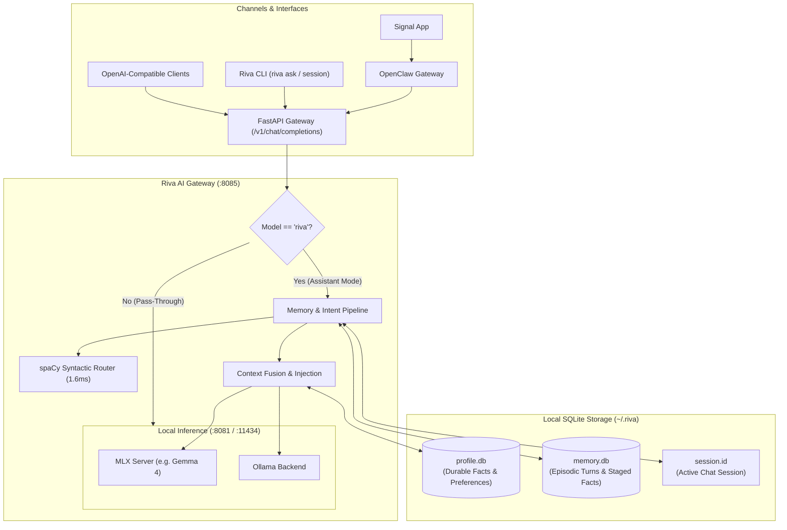

<div align="center">

# Riva Agent

**Private, Persistent AI Assistant Running 100% Locally on Apple Silicon**

[](https://www.python.org/downloads/)
[](https://docs.astral.sh/uv/)
[](https://github.com/ml-explore/mlx)
[](https://www.sqlite.org/)
[](https://github.com/openclaw/openclaw)
[]()
[]()

<br />

Riva is an on-device personal AI platform that remembers who you are across days, weeks, and conversations without leaking private data to cloud providers. Compatible with **Signal** (via OpenClaw), terminal workflows, and standard OpenAI-compatible frontends.

[Quickstart](#quickstart) • [Architecture](#architecture) • [CLI & Signal Reference](#cli--signal-command-reference) • [Documentation](#documentation) • [Genie Packages](#genie-packages)

</div>

---

## Key Highlights

- **100% Local & Private**: All inference (Apple Silicon MLX / Ollama) and storage (local SQLite) remain on your machine. Zero telemetry, zero cloud embedding APIs, zero outbound data leaks.
- **Persistent Dual Memory**:
  - **Profile Store (`profile.db`)**: High-trust, deterministic key-value facts (location, dietary constraints, goals) injected directly into prompts.
  - **Episodic Store (`memory.db`)**: Scoped conversation turns that survive daemon restarts with multi-session isolation.
- **Syntactic Intent Pre-Routing**: In-memory spaCy dependency parsing (~1.6ms CPU) separates personal assertions (*"I use PostgreSQL"*) from imperative queries (*"Explain PostgreSQL to me"*), preventing memory contamination.
- **Multi-Channel Presence**: Seamlessly interact through **Signal** on your phone (routed via OpenClaw), stream in the terminal via `riva ask`, or connect standard OpenAI-compatible web clients.
- **Inspectable Human-in-the-Loop Trust**: Passive facts are **staged, not committed**. Review proposals with `riva memory list --pending`, accept or reject with one command, or permanently purge turns with `riva memory forget`.
- **Local Storage Lifecycle**: Built-in `riva storage` suite for database vacuuming, WAL truncation, 30-day retention pruning, 7-day candidate expiry, copytruncate log rotation, and point-in-time disaster recovery snapshots.

---

## Architecture

Riva separates pass-through model execution from assistant mode via virtual model routing (`model="riva"`), ensuring everyday development prompts remain untouched while assistant conversations gain memory.



---

## Quickstart

### 1. Prerequisites & Installation

Riva uses [`uv`](https://docs.astral.sh/uv/) for high-performance dependency management and workspaces:

```bash
# Clone the repository
git clone https://github.com/anirban-1009/riva.git
cd riva

# Sync core platform dependencies (excludes heavy ML research notebooks)
uv sync
```

> [!TIP]
> If you plan to run local evaluation notebooks in `experiments/`, run `uv sync --all-packages`.

### 2. Start the Local Stack

The stack management script automates launching the local MLX inference server and Riva AI Gateway:

```bash
# Start MLX Inference Backend + Riva AI Gateway in the background
./scripts/start_stack.sh start

# Verify running services and health status
./scripts/start_stack.sh status
```

### 3. Talk to Riva

You can query Riva directly in your terminal, chat over Signal, or run interactive sessions:

```bash
# Streaming conversation turn via terminal
uv run riva ask "What do you know about my goals and dietary constraints?"

# Launch an OpenClaw interactive terminal chat connected to Riva
./scripts/start_stack.sh chat
```

To stop the stack at any time:
```bash
./scripts/start_stack.sh stop
```

---

## CLI & Signal Command Reference

The `riva` CLI is your trust and control surface for inspecting and modifying memory, managing storage hygiene, and rotating chat sessions.

### 1. Chat Sessions & Signal Commands

Riva scopes conversation context to session IDs. You can trigger new sessions from your phone via Signal or from the CLI:

| Channel | Command | Action |
|---|---|---|
| **Signal / OpenClaw** | `/clear`, `/new_session`, `/start`, `new session` | Instantly clears previous conversation context and starts a fresh session without invoking the LLM. |
| **Signal / OpenClaw** | `/new <your question>` | Resets conversation context and answers your prompt immediately in the fresh session. |
| **CLI** | `uv run riva session new` | Generates a new session UUID and persists it to `~/.riva/session.id`. |
| **CLI** | `uv run riva session id` | Prints the active session ID. |
| **CLI** | `uv run riva session list` | Lists recent conversation sessions, turn counts, and timestamps. |
| **REST API** | `POST /v1/session/new` | Programmatically triggers session rotation. |

### 2. Terminal Assistant (`riva ask`)

```bash
# Query Riva in assistant mode with streaming response (injects profile & recent session turns)
uv run riva ask "Can you summarize what we discussed about the architecture?"
```

### 3. Profile Management (`riva profile`)

Inspect, edit, set, and delete durable key-value facts stored in `~/.riva/profile.db`:

```bash
# Show formatted profile context injected into assistant prompts
uv run riva profile show

# Edit entire profile in your favorite editor ($EDITOR) as YAML
uv run riva profile edit

# List all profile entries (or filter by category: facts, goals, constraints, preferences)
uv run riva profile list
uv run riva profile list --category constraints

# Retrieve a specific entry
uv run riva profile get location

# Store or update a durable fact
uv run riva profile set location "Munich" --category facts
uv run riva profile set diet "No peanuts" --category constraints

# Delete an entry
uv run riva profile delete location
```

### 4. Memory Inspection & Human-in-the-Loop Review (`riva memory`)

Control episodic conversation history and staged candidate facts in `~/.riva/memory.db`:

```bash
# List recent conversation turns across sessions
uv run riva memory list
uv run riva memory list --limit 20

# View candidate facts proposed by passive extraction awaiting review
uv run riva memory list --pending

# Accept a staged fact into your durable profile
uv run riva memory accept <id>

# Reject an unwanted candidate proposal
uv run riva memory reject <id>

# Permanently forget/delete an erroneous turn
uv run riva memory forget <id>
```

### 5. Storage Hygiene, Compaction & Snapshots (`riva storage`)

Keep SQLite storage lean, compact WAL logs, enforce log bounds, and snapshot databases:

```bash
# Inspect storage telemetry: DB sizes, WAL overhead, row counts, and logs footprint
uv run riva storage status

# Compact databases and truncate active WAL checkpoints to 0 bytes
uv run riva storage vacuum

# Dry-run retention pruning to preview what would be deleted
uv run riva storage prune --dry-run

# Execute pruning (30-day turns, 7-day unreviewed candidates) & rotate logs > 50MB
uv run riva storage prune
uv run riva storage prune --turns-days 60 --pending-days 14

# Create an online point-in-time snapshot backup in ~/.riva/backups/
uv run riva storage backup
```

---

## Genie Packages

Riva is built as a modular `uv` workspace where domain-specific capabilities reside in isolated packages:

```text
riva/
├── common/             # Shared SQLite models, memory stores, and utilities
├── riva-agent/         # Gateway, CLI, intent routing, and reasoning engine
├── job-genie/          # Career development, resume, and job search tooling
├── money-genie/        # Personal finance and expense tracking capabilities
├── workout-genie/      # Fitness tracking, routines, and health management
├── lighthouse-genie/   # Planning, tech news, paper digests, and productivity
└── experiments/        # Research benchmarks, Mem0 tests, and prototyping notebooks
```

| Package | Status | Responsibility |
|---|---|---|
| **`riva-agent`** | **Shipped (v1)** | Main orchestrator, OpenAI-compatible Gateway, session & intent routing. |
| **`common`** | **Shipped (v1)** | Shared SQLite storage (`EpisodicStore`, `ProfileStore`), config, and models. |
| **`lighthouse-genie`** | Planned (M6) | Autonomous daily digests, research paper triage, and reading lists. |
| **`money-genie`** | Post-v1 | Private personal finance and budget assistant. |
| **`workout-genie`** | Post-v1 | Workout scheduling and fitness tracking. |
| **`job-genie`** | Post-v1 | Career management and portfolio assistance. |
| **`experiments`** | Active | Empirical benchmarks (Mem0 latency, NLP routing, MLX context tests). |

---

## Documentation

The canonical documentation is maintained in the [GitHub Wiki](https://github.com/anirban-1009/riva/wiki) and synchronized in the `docs/` folder:

| Document | Description |
|---|---|
| **[Product Definition](docs/product-definition.md)** | Core principles, v1 acceptance criteria, memory admission policy, and roadmap. |
| **[Development Timeline](docs/development-timeline.md)** | Milestone schedule from Foundation (M0) through Trust CLI (M3/v1) and Semantic Recall (M4). |
| **[Local Dev Runbook](docs/local-dev-runbook.md)** | Service management, port mappings, disaster recovery, and operational procedures. |
| **[Architecture](docs/architecture.md)** | System design, virtual model routing, plugin protocol, and data boundaries. |
| **[Inference Latency Investigation](docs/inference-latency.md)** | Root causes of local model latency, thinking heuristics, and MLX benchmarks. |
| **[Memory Store Evaluation](docs/memory-store-evaluation.md)** | Empirical benchmarks comparing SQLite, local Mem0, and hybrid routing. |
| **[NLP Memory Routing Learnings](docs/nlp-memory-routing.md)** | Why dependency parsing outperforms embedding classification for memory gating. |

---

## Testing & Code Quality

Riva enforces strict code quality and test coverage thresholds across the entire workspace:

```bash
# Run the complete test suite with coverage enforcement (>= 80%)
uv run pytest

# Run linter and formatting checks
uv run ruff check common src tests
uv run ruff format --check common src tests
```

---

## Design Philosophy

1. **Zero Cloud Leaks**: If memory cannot be maintained on-device, it is not stored. No hosted vector databases or hosted embedding APIs.
2. **Inspectability Before Autonomy**: A personal assistant must be inspectable by default. Users must be able to view, edit, or purge anything the assistant knows.
3. **Deterministic Over Heuristic**: Core profile facts use deterministic key-value SQLite tables with `UPSERT` semantics rather than relying on noisy vector deduplication.
4. **Lightweight & Single-User**: SQLite WAL files over server database processes; local Apple Silicon hardware over remote clusters.

---

<div align="center">
Built for private, personal on-device intelligence.
</div>
