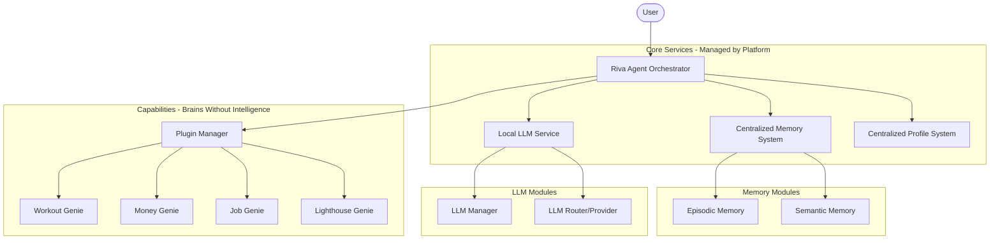

# Riva Agent Architecture

This document describes the design philosophy, layers, core systems, and interfaces for the Riva Agent platform.

---

## 1. System Architecture Overview

Riva Agent is structured into three distinct layers to ensure separation of concerns, high modularity, and centralized reasoning.



---

## 2. Design Philosophy

### "Brains Without Intelligence"
Plugins (Genie packages) do not contain or run their own LLMs, nor do they make linguistic styling or personality decisions.
- A plugin acts as a **domain-specific data provider and tool-execution unit**.
- It exposes structured APIs, gatherers, and schemas.
- It never generates natural language directly to the user.

### Centralized Reasoning & Personality
All language reasoning, instruction following, and personality generation are centralized in the **Local LLM Service** owned by the `riva-agent` orchestrator.
- Ensures a single, consistent personality ("Riva") across all interactions.
- Avoids fragmented, disjointed multi-plugin conversations. If a query touches multiple domains simultaneously, a single LLM synthesizes the context from all relevant plugins into a unified response.

### Infrastructure-Focused Orchestration
The main `riva-agent` orchestrator remains intentionally "dumb" regarding domain knowledge. It has no finance, workout, career, or planning logic. Instead, it focuses purely on infrastructure:
- Session Management
- Query Routing
- Plugin Management
- Memory Retrieval & Profile Access
- Tool Execution
- LLM Interface & Prompt Assembly
- Response Streaming

---

## 3. Centralized Core Services

### Local LLM (`common/llm/`)
Central service through which all text generation and tool routing happens.
- **`manager.py`**: Handles prompts, token limits, system personality, and orchestration of the inference loop.
- **`providers.py`**: Interactivity/adapters for local model runtimes (e.g. llama.cpp, Ollama, vLLM).
- **`router.py`**: Handles dynamic routing of prompts to appropriate model configurations.

### Centralized Memory (`common/memory/`)
A centralized state store that plugins interact with instead of maintaining private databases or separate chat histories.
- **`episodic.py`**: Tracks chronological logs of interactions, conversations, and event timelines.
- **`semantic.py`**: Knowledge store (e.g., vector database) containing factual associations and concepts.

### Unified Profile (`common/profile/`)
Maintains a centralized, unified user model accessible by all Genies. Rather than plugins storing their own copies of user preferences or traits, they read from this single source:
- **Profile Fields**: Name, Goals, Preferences, Habits, Skills, Calendar, Constraints, and Long-term Objectives.
- **Plugin Access Patterns**:
  - **Workout Genie**: Reads fitness goals, physical constraints, and exercise habits.
  - **Money Genie**: Reads income targets, financial constraints, and spending preferences.
  - **Job Genie**: Reads career aspirations, resume records, and current skills.
  - **Lighthouse Genie**: Reads learning goals, interests, and long-term planning objectives.

---

## 4. The Plugin Protocol

To keep the platform extensible, every Genie must implement a unified `Plugin` interface defined under `common/interfaces/plugin.py`:

```python
from typing import Protocol, Any, runtime_checkable
from dataclasses import dataclass

@dataclass
class PluginContext:
    domain: str
    data: dict[str, Any]
    memories: list[dict[str, Any]]
    facts: list[str]

@dataclass
class Tool:
    name: str
    description: str
    parameters: dict[str, Any]

@runtime_checkable
class Plugin(Protocol):
    name: str
    
    async def can_handle(self, request: str, context: dict[str, Any]) -> float:
        """
        Return a confidence score (0.0 to 1.0) indicating relevance 
        of the plugin to the incoming user request.
        """
        ...

    async def gather_context(self, request: str, context: dict[str, Any]) -> PluginContext:
        """
        Retrieve relevant local data, domain-specific memories, 
        and facts required to answer the user request.
        """
        ...

    async def tools(self) -> list[Tool]:
        """
        Expose callable actions/functions that the orchestrator/LLM can invoke.
        """
        ...

    async def execute(self, tool_name: str, **kwargs: Any) -> Any:
        """
        Execute a requested tool with arguments and return the result.
        """
        ...
```

---

## 5. Directory Structure

The repository workspace is organized to clearly isolate common/shared framework utilities from domain-specific capabilities:

```text
riva-agent/
├── pyproject.toml           # Workspace configurations and members
├── README.md                # Platform entry point documentation
│
├── main.py                  # Orchestrator entry point
│
├── riva-agent/              # Platform Orchestrator (Session, router, plugins, execution)
│
├── common/                  # Shared framework core (LLM, memory, profile, interfaces)
│
├── workout-genie/           # Genie: Fitness, health & nutrition coaching
├── money-genie/             # Genie: Personal finance & budgeting
├── job-genie/               # Genie: Career planning & mock interviewing
└── lighthouse-genie/        # Genie: Strategic advisor (News, Notion, learning, goals)
```

---

## 6. Genie Roles and Responsibilities

Each package is dedicated to a specific domain:

| Genie | Responsibilities |
|---|---|
| **💪 Workout Genie** | Fitness planning, workout history logging, nutrition/diet coaching, fitness habits, and progress tracking. |
| **💰 Money Genie** | Budgeting, expense tracking, investment metrics, financial planning, calculations, and savings projection. |
| **💼 Job Genie** | Career roadmapping, resume management, interview preparation workflows, skill gap analysis, and reminders. |
| **💡 Lighthouse Genie** | Personal guide and strategic advisor: tracking AI news, technology trends, research papers, GitHub projects, recommending books, mapping learning roadmaps, integrating with Notion, goal planning, personal knowledge base updates, weekly digests, and reminders. |

---

## 7. Request Resolution Examples

### Example A: Multi-Domain Request
**Query**: *"I have ₹50k this month. I also want to prepare for AI interviews while maintaining my workouts. What should I prioritize?"*

```text
User Request
    │
    ▼
[Riva Agent Orchestrator]
    │
    ├── Step 1: Query Router evaluates which plugins are relevant:
    │     ├── Money Genie (Financial check)   -> Score: 0.95
    │     ├── Job Genie (AI Interview prep)   -> Score: 0.90
    │     ├── Workout Genie (Fitness routine) -> Score: 0.85
    │     └── Lighthouse Genie (Not relevant) -> Score: 0.10 (Skipped)
    │
    ├── Step 2: Gather context from relevant plugins (simultaneously)
    │     ├── money-genie returns budget status (₹50k available)
    │     ├── job-genie returns interview schedules & skills gaps
    │     └── workout-genie returns current exercises and session times
    │
    ├── Step 3: Central Profile & Memory retrieval
    │     └── Fetches central user constraints and preferences
    │
    ├── Step 4: Feed combined context & query to Local LLM
    │     └── Local LLM evaluates constraints, reasoning across budget, time, and goals
    │
    └── Step 5: Synthesize and format final response
          └── Outputs a unified response suggesting how to balance spending, prep schedule, and workouts.
```

### Example B: Strategic Guidance Request
**Query**: *"What happened in AI this week? Should I learn Kimi K2 or DeepSeek? Add the important papers to my Notion."*

```text
User Request
    │
    ▼
[Riva Agent Orchestrator]
    │
    ├── Step 1: Query Router evaluates which plugins are relevant:
    │     └── Lighthouse Genie (AI news, trends, Notion sync) -> Score: 0.98
    │         (Others score near 0.0 and are skipped)
    │
    ├── Step 2: Gather context and execute tools from Lighthouse Genie
    │     ├── Lighthouse searches RSS feeds, arXiv, GitHub, and Hacker News
    │     ├── Lighthouse updates user's Notion page with found papers
    │     ├── Lighthouse sets learning reminders in the user calendar/profile
    │     └── Returns structured results to the Orchestrator
    │
    ├── Step 3: Feed gathered news and actions to Local LLM
    │     └── Local LLM formats and highlights key news, comparing Kimi K2 and DeepSeek
    │
    └── Step 4: Output unified response
          └── Single reasoning engine delivers the weekly AI summary and explains what was saved to Notion.
```
