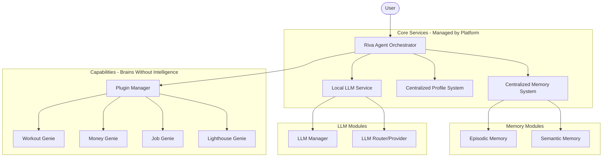

# Riva Agent Architecture

> Mirrors the [wiki](https://github.com/anirban-1009/riva/wiki/Architecture) — the wiki is the canonical source; update it first.

This document describes the design philosophy, layers, core systems, and interfaces for the Riva Agent platform.

**Status**: `riva-agent/api/gateway.py` and `common/llm/providers.py`/`manager.py` are implemented and described below in detail. `common/memory/`, `common/profile/`, `common/llm/router.py`, and `common/interfaces/plugin.py` are **planned, not yet built** — see [Product Definition](product-definition.md) §6 for the v1 build order and why the plugin protocol (§5 below) is deferred past v1.

---

## 1. System Architecture Overview

Riva Agent is structured into three distinct layers to ensure separation of concerns, high modularity, and centralized reasoning.


```mermaid
graph TD
    User([User]) --> Orchestrator[Riva Agent Orchestrator]

    subgraph Core Services [Core Services - Managed by Platform]
        Orchestrator --> MemorySystem[Centralized Memory System]
        Orchestrator --> ProfileSystem[Centralized Profile System]
        Orchestrator --> LLMService[Local LLM Service]
    end

    subgraph Memory Modules
        MemorySystem --> Episodic[Episodic Memory]
        MemorySystem --> Semantic[Semantic Memory]
    end

    subgraph LLM Modules
        LLMService --> Manager[LLM Manager]
        LLMService --> Router[LLM Router/Provider]
    end

    Orchestrator --> PluginManager[Plugin Manager]

    subgraph Plugins [Capabilities - Brains Without Intelligence]
        PluginManager --> Workout[Workout Genie]
        PluginManager --> Money[Money Genie]
        PluginManager --> Job[Job Genie]
        PluginManager --> Lighthouse[Lighthouse Genie]
    end
```

---

## 2. Design Philosophy

### "Brains Without Intelligence"

Plugins (Genie packages) do not contain or run their own LLMs, nor do they make linguistic styling or personality decisions.

- A plugin acts as a **domain-specific data provider and tool-execution unit**.
- It exposes structured APIs, gatherers, and schemas.
- It never generates natural language directly to the user.

### Centralized Reasoning & Personality

All language reasoning, instruction following, and personality generation are centralized in the **Local LLM Service** owned by the `riva-agent` orchestrator.

- Ensures a single, consistent personality ("Riva") across all interactions.
- Avoids fragmented, disjointed multi-plugin conversations. If a query touches multiple domains simultaneously, a single LLM synthesizes the context from all relevant plugins into a unified response.

### Infrastructure-Focused Orchestration

The main `riva-agent` orchestrator remains intentionally "dumb" regarding domain knowledge. It has no finance, workout, career, or planning logic. Instead, it focuses purely on infrastructure:

- Session Management
- Query Routing
- Plugin Management
- Memory Retrieval & Profile Access
- Tool Execution
- LLM Interface & Prompt Assembly
- Response Streaming

---

## 3. Memory and Profile — the Load-Bearing Layer

Per [Product Definition](product-definition.md) §3.2, memory and profile are the product; a Genie is a thing that reads and writes them in a domain-shaped way. Everything else in this document — the gateway, the plugin protocol — sits on top of this layer, which is why it's described first here despite being unbuilt.

**Status: planned, not yet implemented.** Nothing under `common/memory/` or `common/profile/` exists in the repo yet.

### Centralized Memory (`common/memory/`)

A centralized state store that plugins interact with instead of maintaining private databases or separate chat histories.

- **`episodic.py`**: Tracks chronological logs of interactions, conversations, and event timelines.
- **`semantic.py`**: Knowledge store (e.g., vector database) containing factual associations and concepts. Deferred past v1 — see [Product Definition](product-definition.md) §6, "Deliberately not in v1."

### Unified Profile (`common/profile/`)

Maintains a centralized, unified user model accessible by all Genies. Rather than plugins storing their own copies of user preferences or traits, they read from this single source:

- **Profile Fields**: Name, Goals, Preferences, Habits, Skills, Calendar, Constraints, and Long-term Objectives.
- **Plugin Access Patterns**:
  - **Workout Genie**: Reads fitness goals, physical constraints, and exercise habits.
  - **Money Genie**: Reads income targets, financial constraints, and spending preferences.
  - **Job Genie**: Reads career aspirations, resume records, and current skills.
  - **Lighthouse Genie**: Reads learning goals, interests, and long-term planning objectives.

---

## 4. Core Services

### OpenAI-Compatible API Gateway (`riva-agent/api/`)

Exposes standard OpenAI-compatible API endpoints allowing seamless integration with MCP hosts and client runtimes like OpenClaw.

- **`GET /v1/models`**: Queries Ollama's local tags endpoint dynamically and returns available models.
- **`POST /v1/chat/completions`**: Receives chat completion requests, coordinates with `OllamaProvider`, and supports real-time token streaming using Server-Sent Events (SSE).
  - The first SSE chunk carries `delta.role: "assistant"` before any content deltas — required by OpenAI-compatible clients (e.g. OpenClaw) to recognize the start of an assistant turn; omitting it causes the client to silently discard an otherwise-valid stream.
  - During long gaps (e.g. slow prefill on a large prompt, or a cold model load), the stream emits periodic SSE keep-alive comments so proxies/clients don't treat a slow-but-progressing generation as a dead connection. The heartbeat polls the in-flight token task with `asyncio.wait` (not `wait_for`) so the underlying Ollama request is never cancelled while waiting — `wait_for` would tear down and silently truncate any response whose prefill outlasts the heartbeat interval, which is common for large tool-augmented coding-agent prompts.
  - All response/streaming payload shapes (`Chunk`, `StreamChoice`, `Delta`, `ChatCompletionResponse`, `Choice`, `AssistantMessage`, `Model`, `ModelList`) are dataclasses defined in `riva_agent/models/data.py`, serialized with `dataclasses.asdict()`, rather than ad hoc dicts.
  - Requests, the resolved model, and the extended-thinking decision are logged (`request_id`, `model`, `stream`, `think`); exceptions are logged server-side with a stack trace before being surfaced as an HTTP error.
- **`POST /api/show`**: Proxies Ollama's native `/api/show` so Ollama-aware clients (e.g. OpenClaw's model-capability probes) can query model metadata (context length, capabilities, template) through the gateway instead of 404ing.
- **Config overrides (`config.yml`)**: A project-root `config.yml`, loaded once by `riva_agent/config.py`, holds process-wide overrides that always win over whatever an individual client request asks for:
  - `model` — when set, overrides the `model` field of _every_ `/v1/chat/completions` request. This is the single place to switch which model the whole platform serves; if unset, the client's requested model is used as-is.
  - `thinking` — kill switch for the extended-thinking heuristic below. `false` forces `think: false` on every request to a thinking-capable model, regardless of prompt content; unset/`true` (default) leaves the heuristic in charge.
  - `streaming` — kill switch for SSE streaming. `false` forces every `/v1/chat/completions` response to be non-streaming JSON even if the client sent `"stream": true`; unset/`true` (default) respects the client's request.
- **Extended-thinking heuristic (`riva_agent/reasoning.py`)**: Decides per-request whether to enable Ollama's `think` field, so simple prompts stay fast and only complex ones pay the reasoning-latency cost — unless overridden off entirely by `config.yml`'s `thinking: false` above.
  - The gateway first calls `OllamaProvider.get_capabilities(model)`, which queries Ollama's own `/api/tags` (cached 5 minutes) for that model's reported capabilities, and only proceeds if `"thinking"` is among them. This replaced an earlier hardcoded regex of known reasoning-model names (`qwen3`, `deepseek-r1`, `gpt-oss`, …) after that list caused a real bug: it didn't include `gemma4`, so the gateway never sent `think: false` to it — and `gemma4` defaults to thinking **on** when the field is omitted, silently adding several seconds of unwanted reasoning to every single reply. Querying Ollama directly means a newly pulled or renamed model is handled correctly with no code change.
  - `should_use_extended_thinking(messages)` then looks at the prompt itself — explicit reasoning language ("step by step", "trade-off", "optimize", "design a", …), inline math expressions, or a prompt over ~80 words — to decide `true`/`false`. No extra model call is made to decide this (just the cached capability lookup above).
- **Reported version**: The gateway's OpenAPI `version` field is read live from installed package metadata (`importlib.metadata.version("riva-agent")`) rather than hardcoded, so it can never drift from `pyproject.toml`.

### Local LLM (`common/llm/`)

Central service through which all text generation and tool routing happens.

- **`providers.py`**: Interactivity/adapters for local model runtimes (Ollama/Gemma).
  - Uses a **shared, class-level `httpx.AsyncClient`** across all `OllamaProvider` instances/requests, so connections are pooled instead of re-established per request.
  - Uses a **generous read timeout (300s)** with a fast connect timeout (10s) — local model generation can legitimately take minutes, but a dead Ollama instance should still fail fast.
  - Sends **`keep_alive: "30m"`** on every request to Ollama, keeping the model resident in memory between turns. Ollama's own default (5m) is short enough that a normal back-and-forth conversation can force a full cold model reload between messages, which is the dominant source of perceived latency for local models.
  - Utilizes `aiter_lines()` for fast, non-blocking token-level streaming.
  - `chat`/`chat_async`/`chat_stream` accept an optional `think: bool | None`, forwarded to Ollama's payload only when set, so models that don't support thinking never see the field.
  - `get_capabilities(model)` queries `/api/tags` for a model's reported capabilities (e.g. `["completion", "tools", "thinking"]`), caching the full model→capabilities map for 5 minutes so the gateway isn't hitting Ollama on every chat request just to make the thinking decision.
- **`manager.py`**: Handles prompts, token limits, system personality, and orchestration of the inference loop, exposing async and streaming (`generate_stream`) response generators.
- **`router.py`**: Handles dynamic routing of prompts to appropriate model configurations. **Planned, not yet implemented** — today the gateway routes by the `model` field directly (see [Product Definition](product-definition.md) §5); this module doesn't exist in the repo yet.

---

## 5. The Plugin Protocol

**Status: deferred to post-v1.** Per [Product Definition](product-definition.md) §6, this interface is a design sketch, not a v1 build target: it's specified in full below before a single Genie exists, which the product definition calls out as a real risk — the confidence-score routing in particular (`can_handle` returning a float) assumes a routing model that's never been tested. The plan is to build the memory layer first, then one real Genie directly against it, then extract this protocol from what that Genie actually needed.

To keep the platform extensible, every Genie must implement a unified `Plugin` interface defined under `common/interfaces/plugin.py`:

```python
from typing import Protocol, Any, runtime_checkable
from dataclasses import dataclass

@dataclass
class PluginContext:
    domain: str
    data: dict[str, Any]
    memories: list[dict[str, Any]]
    facts: list[str]

@dataclass
class Tool:
    name: str
    description: str
    parameters: dict[str, Any]

@runtime_checkable
class Plugin(Protocol):
    name: str

    async def can_handle(self, request: str, context: dict[str, Any]) -> float:
        """
        Return a confidence score (0.0 to 1.0) indicating relevance
        of the plugin to the incoming user request.
        """
        ...

    async def gather_context(self, request: str, context: dict[str, Any]) -> PluginContext:
        """
        Retrieve relevant local data, domain-specific memories,
        and facts required to answer the user request.
        """
        ...

    async def tools(self) -> list[Tool]:
        """
        Expose callable actions/functions that the orchestrator/LLM can invoke.
        """
        ...

    async def execute(self, tool_name: str, **kwargs: Any) -> Any:
        """
        Execute a requested tool with arguments and return the result.
        """
        ...
```

---

## 6. Directory Structure

The repository workspace is organized to clearly isolate common/shared framework utilities from domain-specific capabilities:

```text
riva-agent/
├── pyproject.toml           # Workspace configurations and members
├── README.md                # Platform entry point documentation
│
├── main.py                  # Orchestrator entry point
│
├── riva-agent/              # Platform Orchestrator (Session, router, plugins, execution)
│
├── common/                  # Shared framework core (LLM, memory, profile, interfaces)
│
├── workout-genie/           # Genie: Fitness, health & nutrition coaching
├── money-genie/             # Genie: Personal finance & budgeting
├── job-genie/               # Genie: Career planning & mock interviewing
└── lighthouse-genie/        # Genie: Strategic advisor (News, Notion, learning, goals)
```

---

## 7. Genie Roles and Responsibilities

Each package is dedicated to a specific domain:

| Genie                   | Responsibilities                                                                                                                                                                                                                                                    |
| ----------------------- | ------------------------------------------------------------------------------------------------------------------------------------------------------------------------------------------------------------------------------------------------------------------- |
| **💪 Workout Genie**    | Fitness planning, workout history logging, nutrition/diet coaching, fitness habits, and progress tracking.                                                                                                                                                          |
| **💰 Money Genie**      | Budgeting, expense tracking, investment metrics, financial planning, calculations, and savings projection.                                                                                                                                                          |
| **💼 Job Genie**        | Career roadmapping, resume management, interview preparation workflows, skill gap analysis, and reminders.                                                                                                                                                          |
| **💡 Lighthouse Genie** | Personal guide and strategic advisor: tracking AI news, technology trends, research papers, GitHub projects, recommending books, mapping learning roadmaps, integrating with Notion, goal planning, personal knowledge base updates, weekly digests, and reminders. |

---

## 8. Request Resolution Examples

### Example A: Multi-Domain Request

**Query**: _"I have ₹50k this month. I also want to prepare for AI interviews while maintaining my workouts. What should I prioritize?"_

```text
User Request
    │
    ▼
[Riva Agent Orchestrator]
    │
    ├── Step 1: Query Router evaluates which plugins are relevant:
    │     ├── Money Genie (Financial check)   -> Score: 0.95
    │     ├── Job Genie (AI Interview prep)   -> Score: 0.90
    │     ├── Workout Genie (Fitness routine) -> Score: 0.85
    │     └── Lighthouse Genie (Not relevant) -> Score: 0.10 (Skipped)
    │
    ├── Step 2: Gather context from relevant plugins (simultaneously)
    │     ├── money-genie returns budget status (₹50k available)
    │     ├── job-genie returns interview schedules & skills gaps
    │     └── workout-genie returns current exercises and session times
    │
    ├── Step 3: Central Profile & Memory retrieval
    │     └── Fetches central user constraints and preferences
    │
    ├── Step 4: Feed combined context & query to Local LLM
    │     └── Local LLM evaluates constraints, reasoning across budget, time, and goals
    │
    └── Step 5: Synthesize and format final response
          └── Outputs a unified response suggesting how to balance spending, prep schedule, and workouts.
```

### Example B: Strategic Guidance Request

**Query**: _"What happened in AI this week? Should I learn Kimi K2 or DeepSeek? Add the important papers to my Notion."_

```text
User Request
    │
    ▼
[Riva Agent Orchestrator]
    │
    ├── Step 1: Query Router evaluates which plugins are relevant:
    │     └── Lighthouse Genie (AI news, trends, Notion sync) -> Score: 0.98
    │         (Others score near 0.0 and are skipped)
    │
    ├── Step 2: Gather context and execute tools from Lighthouse Genie
    │     ├── Lighthouse searches RSS feeds, arXiv, GitHub, and Hacker News
    │     ├── Lighthouse updates user's Notion page with found papers
    │     ├── Lighthouse sets learning reminders in the user calendar/profile
    │     └── Returns structured results to the Orchestrator
    │
    ├── Step 3: Feed gathered news and actions to Local LLM
    │     └── Local LLM formats and highlights key news, comparing Kimi K2 and DeepSeek
    │
    └── Step 4: Output unified response
          └── Single reasoning engine delivers the weekly AI summary and explains what was saved to Notion.
```

---

## 9. Deployment, Docker & Versioning

### Container Setup

`riva-agent` runs as a single Docker service (`docker-compose.yml`) that connects to **Ollama running natively on the host**, not a containerized Ollama. This avoids duplicating multi-gigabyte model downloads inside the container when the host already has them.

- `OLLAMA_BASE_URL=http://host.docker.internal:11434` — reaches the host's Ollama daemon from inside the container.
- `extra_hosts: ["host.docker.internal:host-gateway"]` — required for the `host.docker.internal` DNS name to resolve on Linux hosts (works out-of-the-box on Docker Desktop for Mac).

### Versioning

`pyproject.toml`'s `[project.version]` (root package `riva-agent`) is the **single source of truth** for the platform's version. Nothing else hardcodes a duplicate version string:

- The gateway reads it at runtime via `importlib.metadata.version("riva-agent")` (see above).
- Docker images carry it as an OCI label (`org.opencontainers.image.version`), injected at build time via a `VERSION` build arg.

Workspace member packages (`common`, `job-genie`, `money-genie`, `workout-genie`, `lighthouse-genie`, `experiments`) each keep their own `version` field in their `pyproject.toml`, but these are internal-only libraries never published independently — they aren't kept in lockstep with the root version, and their version numbers carry no operational meaning.

### Releasing & `scripts/build.sh`

`scripts/build.sh` cuts a full release in one step: bump version → regenerate changelog → commit → tag → build. Version bumping, changelog generation, the release commit, and the git tag are all delegated to [commitizen](https://commitizen-tools.github.io/commitizen/) (`cz`), run ephemerally via `uvx --from commitizen cz ...` so it isn't a project runtime dependency — an earlier version of this script hand-rolled all of that logic (bespoke `sed` version bumping, a `git log`-driven changelog), which duplicated a well-tested tool for no benefit and had its own portability bug (see below).

```bash
./scripts/build.sh          # auto-detects bump from conventional-commit types
./scripts/build.sh patch    # force a patch bump (0.1.0 -> 0.1.1)
./scripts/build.sh minor    # force a minor bump (0.1.0 -> 0.2.0)
./scripts/build.sh major    # force a major bump (0.1.0 -> 1.0.0)
```

1. **Refuses to run on a dirty working tree** (`git status --porcelain`) — the release commit should contain only the version bump and changelog, not whatever else happens to be lying around.
2. **`cz bump [--increment PATCH|MINOR|MAJOR] --changelog --yes`**: with no explicit increment, commitizen inspects commits since the last `vX.Y.Z` tag and picks the bump itself per conventional-commit semantics (`feat` → minor, `fix`/`refactor`/`perf` → patch, `BREAKING CHANGE`/`!` → major); an explicit `patch`/`minor`/`major` argument overrides that detection. It bumps `[project].version` in `pyproject.toml` directly (`version_provider = "pep621"` in `[tool.commitizen]`, so there's no separate commitizen-only version field to keep in sync), regenerates `CHANGELOG.md` grouped under `### Feat`/`### Fix`/`### Refactor`/`### Perf` headings (commits of other conventional types — `docs`, `chore`, `test`, `style`, `build`, `ci` — are intentionally treated as non-release-worthy and left out entirely, matching commitizen's own defaults), then commits (`bump: version X.Y.Z → X.Y.Z`) and tags (`vX.Y.Z`) in one step.
3. **Builds and tags the image**, both the bumped version and a moving `latest`:

   ```bash
   docker build --build-arg VERSION="$VERSION" -t "riva-agent:$VERSION" -t riva-agent:latest .
   ```

`docker-compose.yml`'s image reference is env-driven: `image: riva-agent:${RIVA_TAG:-latest}`.

- `docker compose up -d` → runs whatever was built most recently (`latest`).
- `RIVA_TAG=0.1.0 docker compose up -d` → pins to that exact version without rebuilding, useful for rollback or reproducing a bug against a known-good build.

**Testing changes to this script**: cloning the repo (`git clone`) only reproduces _committed_ history — any uncommitted edit to the script itself, or to `pyproject.toml`'s `[tool.commitizen]` config, won't appear in the clone until it's committed. A disposable clone is still useful for a dry run of the bump/tag/changelog flow without touching real repo history (overlay the working-tree files that haven't been committed yet before testing), but any Docker image built from that clone lands in the **same local Docker daemon and tag namespace** as the real project — a test run there can silently repoint `riva-agent:latest` at a throwaway image full of fake commits. Retag it back (`docker tag riva-agent:<real-version> riva-agent:latest`) before trusting `docker compose up -d` again.

A note from the previous, hand-rolled version of this script, kept because the failure mode is worth remembering: its `sed` version bump used a `0,/pattern/` range address, a GNU-only extension that silently no-ops on macOS's BSD `sed` — no error, the version just never changed. Fixed there with a plain `s/.../.../` substitution; moot now that `cz` owns the bump entirely, but the general lesson (GNU vs. BSD tool flags failing silently rather than loudly) applies anywhere this repo's scripts shell out to `sed`/`awk`.
