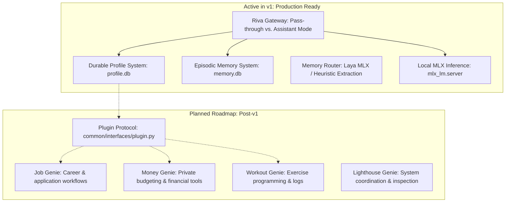

# What You Can Ask Riva: Capabilities, Memory & Architecture Roadmap

> Guide to querying Riva, understanding the on-device memory and profile layers, what is active today in v1, and the status of domain Genies.

Riva is an on-device personal AI assistant designed around one core differentiator: **it accumulates a durable model of you over time without sending personal data to hosted cloud providers**.

Unlike stateless hosted LLMs that treat every session as a stranger, Riva injects your durable personal profile and past conversation context directly into prompt assembly.

---

## 1. What Is Implemented Today vs. Planned Roadmap

Per the product definition ([docs/product-definition.md](product-definition.md) §6), **v1 is strictly focused on memory and profile persistence**: *"v1 is done when Riva remembers me across sessions, and I trust what it remembers."*



| Component | Status | Description |
|---|:---:|---|
| **Durable Profile (`profile.db`)** | **Active (v1)** | Persists facts, constraints, goals, and preferences; injected into prompts. |
| **Episodic Memory (`memory.db`)** | **Active (v1)** | Records turns; scoped by session; injects recent context. |
| **Memory Router & Candidate Staging** | **Active (v1)** | Fast syntactic regex (<0.2ms) or in-process Laya MLX SLM to stage candidate facts for review. |
| **Dual-Mode Gateway (`gateway.py`)** | **Active (v1)** | `pass-through` (clean proxy for OpenClaw) vs `assistant` (injects profile & memory). |
| **Domain Genies (`job`, `money`, `workout`, `lighthouse`)** | **Planned (Post-v1)** | Scaffolded workspace packages; plugin protocol and tool execution deferred to post-v1. |

> [!NOTE]
> **Why the Genies aren't wired yet**: As detailed in [docs/product-definition.md](product-definition.md) §6, building the plugin protocol before having a rock-solid, trusted memory foundation leads to premature abstractions. The memory layer was built first; dedicated Genie plugins and tool integrations will be added next.

---

## 2. System States: What You Can Do When

Riva operates across two distinct modes: **Running (Live Inference)** and **Offline (Trust & Storage Inspection)**.

| Capability | Offline / Stack Stopped | Online / Stack Running (`./scripts/start_stack.sh start`) |
|---|:---:|:---:|
| **Live Conversation (`riva ask`)** | ❌ Backend unreachable | ✔ Real-time streaming assistant turn |
| **OpenClaw Terminal Chat (`start_stack.sh chat`)** | ❌ Backend unreachable | ✔ Interactive chat TUI |
| **Signal Messaging** | ❌ Gateway offline | ✔ Full chat & session rotation |
| **Inspect Profile Facts (`riva profile show`)** | ✔ Direct SQLite read | ✔ Direct SQLite read |
| **Edit Profile (`riva profile edit`)** | ✔ YAML editor in terminal | ✔ YAML editor in terminal |
| **Review Candidate Memories (`riva memory list`)** | ✔ Direct SQLite read | ✔ Direct SQLite read |
| **Storage Diagnostics (`riva storage status`)** | ✔ Direct SQLite read | ✔ Direct SQLite read |

---

## 3. What You Can Ask Riva Right Now (When Stack Is Running)

When the stack is started (`./scripts/start_stack.sh start`), all queries sent in **Assistant Mode** (via `uv run riva ask "..."` or specifying `model: "riva"`) benefit from your personal profile and memory.

### A. Personal Profile & Durable Facts
Riva automatically injects facts from `~/.riva/profile.db` into the system prompt:
* **Identity & Facts**:
  * *"Where am I located?"* (Recalls e.g. `Hyderabad` from your profile)
  * *"What is my current job role?"* (Recalls facts about your role and company)
* **Constraints & Preferences**:
  * *"What dietary constraints do I have?"*
  * *"What communication style do I prefer?"*
* **Active Goals**:
  * *"What are my active quarterly goals?"*
  * *"Help me review progress on my learning goals."*

```bash
# You can view or add profile facts directly anytime:
uv run riva profile show
uv run riva profile set dietary "Vegetarian" --category constraints
uv run riva profile set role "AI/ML Engineer" --category facts
```

---

### B. Episodic Memory & Dialogue Recall
Riva records assistant-mode turns in `~/.riva/memory.db`:
* **Session Recall**:
  * *"What was the last thing we talked about?"*
  * *"Remind me of the solution we discussed for my database configuration."*
* **Candidate Memory Staging**:
  * When you mention new facts during conversation (e.g. *"I'm planning to take the AWS Machine Learning Specialty exam next month"*), Riva's Memory Router stages candidate facts.
  * You can inspect, accept, or reject staged facts:
    ```bash
    uv run riva memory list --pending
    uv run riva memory accept <id>
    uv run riva memory reject <id>
    ```

---

### C. Career, Finance & Health Inquiries (Using Personal Context)
While specialized Genie plugins (with automated tools/scraping) are scheduled for post-v1, **you can still ask career, financial, and fitness questions today**. Riva's local LLM answers them through the lens of your personal profile:

* **Career & Development** (Future `job-genie` domain):
  * *"Help me prepare for an interview for a Staff AI/ML Engineer role."*
  * *"Review this bullet point from my resume to highlight measurable impact."*
* **Personal Finance & Budgeting** (Future `money-genie` domain):
  * *"Help me set up a 50/30/20 monthly budgeting split based on my savings goals."*
  * *"What are best practices for building a 6-month emergency reserve?"*
* **Fitness & Wellness** (Future `workout-genie` domain):
  * *"Design a 4-day upper/lower strength split that fits into 45-minute sessions."*
  * *"Suggest home workout alternatives if I don't have access to a barbell."*

---

### D. General Reasoning, Coding & Extended Thinking
Powered on-device by your configured MLX model (e.g. `mlx-community/gemma-4-E4B-it-qat-4bit`):
* *"Explain how SQLite WAL mode handles concurrency compared to rollback journaling."*
* *"Write an asynchronous Python function to consume an SSE stream using httpx."*
* Extended thinking (`thinking: true` in `config.yml`) enables concise reasoning chains before the final output for complex logic or coding tasks.

---

## 4. What You Can Do in Offline / Stopped State

When `mlx_lm.server` and Riva Gateway are stopped, you can still manage your local trust surface and storage:

```bash
# 1. View all durable profile facts
uv run riva profile show

# 2. Open entire profile in $EDITOR as YAML
uv run riva profile edit

# 3. View past conversation turns across sessions
uv run riva memory list --limit 10

# 4. Check database file size and log telemetry
uv run riva storage status

# 5. Vacuum SQLite databases and checkpoint WAL files
uv run riva storage vacuum

# 6. Create point-in-time snapshots in ~/.riva/backups/
uv run riva storage backup
```

---

## 5. Summary Cheat Sheet

| Intent | State Needed | Command / Query |
|---|:---:|---|
| **Start full stack** | Offline | `./scripts/start_stack.sh start` |
| **Check stack health** | Any | `./scripts/start_stack.sh status` |
| **Ask assistant a question** | Online | `uv run riva ask "Where do I live?"` |
| **Interactive TUI chat** | Online | `./scripts/start_stack.sh chat` |
| **View durable profile** | Any | `uv run riva profile show` |
| **Review staged memories** | Any | `uv run riva memory list --pending` |
| **Clean / vacuum storage** | Any | `uv run riva storage vacuum` |
| **Stop full stack** | Online | `./scripts/start_stack.sh stop` |
