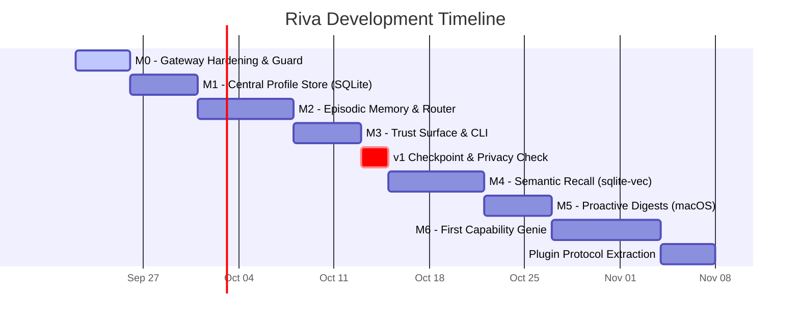

# Riva Agent: Development Timeline & Roadmap

Based on the canonical specifications in [Product-Definition.md](file:///Users/anirban/Personal/riva/wiki/Product-Definition.md) and [Architecture.md](file:///Users/anirban/Personal/riva/wiki/Architecture.md), this document outlines a phased development timeline to deliver Riva as a private, persistent personal assistant.

---

## Roadmap Overview & Milestones

---

## Milestone Breakdown & Target Timelines

### Phase 1: Foundation & Gateway Hardening (M0)
**Estimated Duration**: ~3–4 Days  
**Primary Focus**: Lock in streaming reliability, privacy constraints, and dual-mode routing.

- **Dual-Mode Gateway Routing (§5 of Product Definition)**:
  - `model: "riva"` activates Assistant mode (prompt assembly, memory injection).
  - Any concrete model (e.g. `gemma4:12b-mlx`, `llama3:8b`) remains **Pass-through mode** (byte-for-byte proxy, 0ms overhead, no memory reads/writes, ensuring OpenClaw stays unaffected).
- **Streaming Contract Tests**:
  - Verify initial SSE role chunk (`delta.role: "assistant"`).
  - Test keep-alive heartbeat polling via `asyncio.wait` during model prefill.
- **Privacy Hardening**:
  - Explicitly guard the `openai` provider in `config.yml` as evaluation/benchmarking-only with runtime warnings.
- **Exit Criteria**:
  - All existing coding tools (OpenClaw) continue to work with identical latency and zero prompt pollution.

---

### Phase 2: The User Profile System (M1)
**Estimated Duration**: ~4–5 Days  
**Primary Focus**: A persistent, structured model of the user that survives restarts.

- **Local Storage Engine**:
  - SQLite database at `~/.riva/profile.db` (zero network surface, inspectable via `sqlite3` CLI).
- **Schema & Data Models**:
  - Goals (career, fitness, learning, finance).
  - Constraints (dietary, time, hardware, financial).
  - Preferences (communication style, stack, conventions).
  - Explicit durable facts.
- **Profile Operations & Tooling**:
  - Programmatic read/write API under `common/profile/`.
  - Human-friendly export/import (YAML/Markdown) for direct manual editing.
  - Prompt context formatter (generates a concise system prompt injection).
- **Exit Criteria**:
  - Profile persists across restarts; manually editable in text; formats cleanly into LLM prompts within token budget.

---

### Phase 3: Episodic Memory & Syntactic Admission Router (M2)
**Estimated Duration**: ~6–7 Days  
**Primary Focus**: Conversation recording, recency retrieval, and deterministic fact admission.

- **Episodic Conversation Store**:
  - Chronological session and turn logging in SQLite (`~/.riva/memory.db`).
  - Recency-based windowing (retrieving the most recent $N$ conversational turns).
- **Syntactic Pre-Router (`common/memory/router.py`)**:
  - Based on the [NLP Memory Routing findings](file:///Users/anirban/Personal/riva/wiki/NLP-Memory-Routing-Learnings-and-Pitfalls.md).
  - Lightweight spaCy dependency parsing (~1.6ms CPU latency).
  - Suppress memory writes on imperative commands ("Explain Docker").
  - Detect first-person declarations (`nsubj` / `poss` relations: "I use Postgres").
  - Conservative compound sentence splitting.
- **Admission Policy Implementation (§6)**:
  - **Explicit saves** ("Remember that I run every morning") $\rightarrow$ committed immediately with tag `explicit`.
  - **Passive candidates** $\rightarrow$ extracted post-turn, marked `pending` with source snippet for review.
- **Exit Criteria**:
  - Assistant mode captures conversation history; accurately isolates first-person durable facts without topic-based false positives.

---

### Phase 4: Trust Surface & CLI — v1 Ship (M3)
**Estimated Duration**: ~4–5 Days  
**Primary Focus**: User-facing trust, transparency, and the primary personal interface.

- **Terminal Interface (`riva ask`)**:
  - Command-line conversation using the assistant pipeline (`riva ask "<prompt>"`).
- **Memory Inspection & Correction Surface (§3.3)**:
  - `riva memory list`: Displays all committed facts with provenance and source conversation.
  - `riva memory list --pending`: Surfaces uncommitted passive proposals.
  - `riva memory accept <id>` / `riva memory reject <id>`: Quick approval loop.
  - `riva memory forget <id>`: Immediate, permanent removal of erroneous or stale facts.
- **Profile CLI**:
  - `riva profile show` and `riva profile edit` (opens `$EDITOR`).
- **v1 Acceptance Sign-Off**:
  - [x] Profile persists across restarts.
  - [x] Episodic conversations survive restarts.
  - [x] Recall works in fresh sessions without restating facts.
  - [x] Pass-through mode remains untouched.
  - [x] Memory is inspectable and correctable (`list` / `forget`).
  - [x] Privacy audit: Zero outbound network traffic during assistant sessions.

---

### Phase 5: Semantic Recall (M4 — Post-v1)
**Estimated Duration**: ~6–7 Days  
**Primary Focus**: Finding relevant facts across weeks/months beyond simple recency.

- **Local Embeddings Only**:
  - Local embedding model (e.g. `nomic-embed-text` via Ollama or local MLX).
  - Zero cloud embedding APIs (preserving Principle 3.1).
- **Vector Storage**:
  - Integrate `sqlite-vec` extension into the existing SQLite store (no extra database processes).
- **Hybrid Retrieval**:
  - Combine profile constraints + recent conversation turns + top-$k$ semantic facts.
  - Deduplication and conflict detection.

---

### Phase 6: Proactive Local Digests (M5)
**Estimated Duration**: ~4–5 Days  
**Primary Focus**: Riva initiating value autonomously without waiting for a prompt.

- **Local Scheduler**:
  - macOS `launchd` service or lightweight cron trigger.
- **Durable Output**:
  - Writes digest summaries directly to local Markdown files in `~/riva/digests/`.
- **Local Alerting**:
  - Trigger native macOS banner notification via `osascript` (zero external push infrastructure).

---

### Phase 7: First Capability Genie — Lighthouse Genie (M6)
**Estimated Duration**: ~7–10 Days  
**Primary Focus**: Building one real capability directly against the memory layer, then extracting the Plugin Protocol.

- **Why Lighthouse First**:
  - Least sensitive domain (AI papers, tech news, GitHub trending, reading list).
  - Natural fit for periodic proactive runs (M5 scheduler integration).
- **Implementation**:
  - Build directly as a reader and writer of memory and profile (no custom protocol upfront).
- **Protocol Extraction**:
  - Extract `common/interfaces/plugin.py` based on what Lighthouse Genie *actually* needed, replacing speculative abstractions with tested interfaces.

---

## Summary Timeline Table

| Phase | Milestone | Core Deliverable | Target Working Window |
|---|---|---|---|
| **Phase 1** | **M0** | Gateway Hardening, SSE Contracts, Pass-through / Assistant Routing | Week 1 (Days 1–4) |
| **Phase 2** | **M1** | Persistent User Profile (SQLite + Prompt Injection) | Week 1–2 (Days 5–9) |
| **Phase 3** | **M2** | Episodic Memory & spaCy Syntactic Router | Week 2–3 (Days 10–16) |
| **Phase 4** | **M3** | Trust CLI (`riva ask`, `riva memory list/forget`) $\rightarrow$ **v1 SHIPS** | Week 3–4 (Days 17–21) |
| **Phase 5** | **M4** | Local Vector Search (`sqlite-vec` + local embeddings) | Week 4–5 (Days 22–28) |
| **Phase 6** | **M5** | Proactive Local Digests (`launchd` + macOS notification) | Week 5–6 (Days 29–33) |
| **Phase 7** | **M6** | Lighthouse Genie & Plugin Protocol Extraction | Week 6–7 (Days 34–43) |
