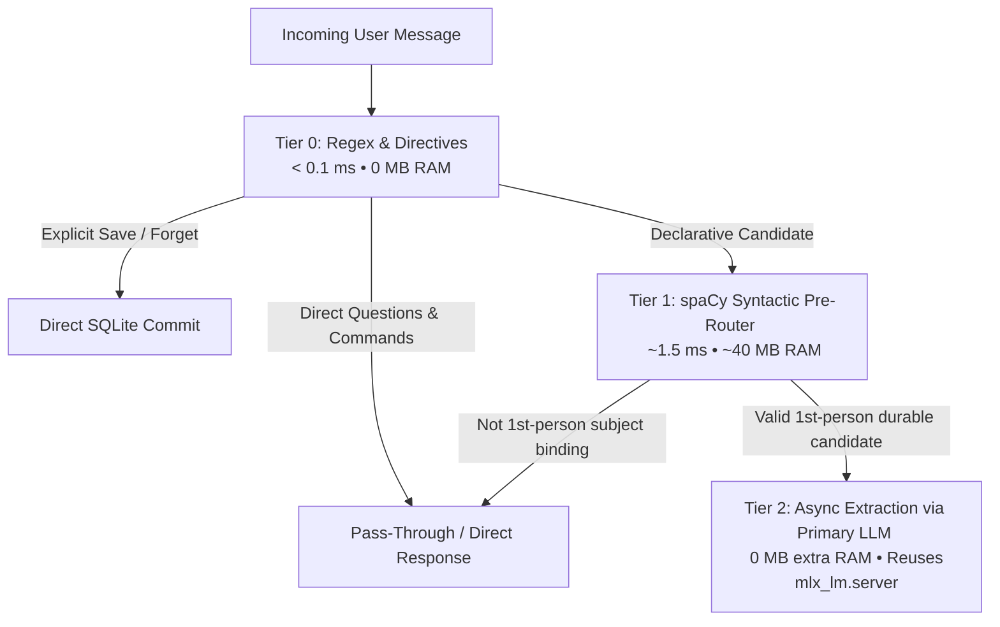

# Laya MLX and Compute Bottlenecks: Assessment, Profiling, and the Path to Lean Execution

> Mirrors the [wiki](https://github.com/anirban-1009/riva/wiki/Laya-MLX-And-Compute-Bottlenecks) — the wiki is the canonical source; update it first.

This document details the memory and compute investigation on the dev machine (Apple Silicon M3 Pro, 18GB unified memory) running Riva, the performance and resource assessment of `laya-mlx` for in-process routing, and the resulting architectural shift toward a zero-waste compute hierarchy.

---

## 1. Context: Sluggish Responses and Severe Memory Pressure

While testing memory recording and thinking-router flows, the local dev stack suffered from degraded response times, gateway warm-up stalls, and system-wide sluggishness.

A system audit revealed severe memory exhaustion:
```text
vm.swapusage: total = 8192.00M  used = 7331.12M  free = 860.88M  (90% consumed)
Pages stored in compressor: 1,495,922  (~24 GB of uncompressed memory pages)
```

On an 18GB unified memory machine, macOS was running under extreme memory compression with over 7.3GB paged out to disk swap, causing continuous page faults and thrashing on every inference step.

---

## 2. Root Cause Breakdown: Where the RAM Went

A granular process audit (`top`, `ps`, and process group mapping) identified four compounding contributors to the memory bottleneck:

### A. Model Sprawl: Multiple Active Neural Networks
Riva was running **three distinct neural network instances** concurrently across separate runtimes:

| Process / Component | Engine | Model | Resident RAM | Role |
|---|---|---|---|---|
| `mlx_lm.server` | MLX Metal Server | `gemma-4-E4B-it-qat-4bit` | **~6.0 GB** (+ dynamic KV) | Primary LLM (Inference) |
| `ThinkingRouter` (`reasoning.py`) | In-process `laya-mlx` | `aac6fef/laya-mlx` | **~800 MB** (+ Metal buffers) | Classify prompt complexity (`none`, `low`, `high`) |
| `MemoryRouter` (`memory_router.py`) | In-process `laya-mlx` | `aac6fef/laya-mlx` | **~800 MB** (+ Metal compile) | Classify fact durability (`durable` vs `momentary`) |

Because `ThinkingRouter` and `MemoryRouter` both executed `laya.load("aac6fef/laya-mlx")` independently, the weights and Metal graph buffers were allocated redundantly in Python memory, pulling ~1.6GB of unified memory strictly for routing heuristics.

### B. Unbounded KV Cache in `mlx_lm.server`
By default, `mlx_lm.server` launched without explicit prompt or attention cache constraints (`--prompt-cache-bytes` or `--prompt-cache-size`). When long coding context histories or multi-turn sessions passed through the gateway from clients like OpenClaw, the attention KV cache grew dynamically, ballooning by 1.5–3.0GB and triggering swap out of idle desktop processes.

### C. In-Editor Language Server Footprint (`pyrefly`)
Antigravity IDE's active Python extension (`meta.pyrefly-1.3.1`, Meta's Python LSP) was holding:
```text
PID 6348 (pyrefly lsp):  1,165 MB resident  +  1,164 MB compressed  (~2.3 GB total footprint)
```
Indexing full virtual environments (`.venv`) containing heavy native wheels (`mlx`, `spacy`, `uvicorn`, `pydantic`) caused the language server's in-memory AST and type dependency graph to consume substantial unified memory.

### D. Stale Background Kernels
An unclosed Jupyter/IPython notebook kernel (`ipykernel_launcher`, PID 4307) from earlier prototyping sessions was lingering in `.venv`, holding **1.4 GB resident RAM + 1.2 GB compressed swap** (~2.6 GB total) while completely idle.

---

## 3. Assessment of Laya MLX

`laya-mlx` was introduced during memory exploration experiments (`experiments/src/understanding-mem0/laya-memory.ipynb`) as a lightweight Small Language Model (SLM) to provide structured binary contrast decisions:
1. Distinguishing durable personal facts from ephemeral states in memory routing.
2. Estimating query complexity to toggle extended reasoning in the thinking router.

### Why Laya MLX is Poorly Suited for the Hot Path

1. **Heavy Resource-to-Value Ratio**:
   `aac6fef/laya-mlx` requires 804MB of model weights on disk and allocates substantial resident memory and Metal buffers. In a resource-constrained 18GB developer environment, committing 0.8–1.6GB to auxiliary classifiers is the primary catalyst that pushes the system past physical capacity into disk swap.
2. **Cold-Start Compilation Overhead**:
   Initializing `laya.load(..., compile=True)` invokes Metal graph tracing and compilation. This introduces a 2–4 second latency spike during gateway startup and memory router instantiation.
3. **Redundant for Intent Classification**:
   As demonstrated in [[NLP-Memory-Routing-Learnings-and-Pitfalls]], memory admission is fundamentally a **syntactic structure** problem, not a neural semantics problem. Whether a sentence asserts personal state ("I use Postgres") versus giving an imperative command ("Explain Postgres to me") is determined by dependency parse bindings (`nsubj` / `poss` relations), not by semantic embeddings. A 1.6ms CPU-only spaCy pass achieves higher accuracy without allocating neural weights.
4. **Duplication of Existing LLM Infrastructure**:
   For edge cases where deep semantic arbitration is genuinely needed, a powerful instruction-tuned model (`gemma-4`) is **already resident and running** on `http://localhost:8081`. Launching a secondary SLM in Python instead of dispatching an async verification prompt to the existing model is pure waste.

---

## 4. The 3-Tier Zero-Waste Compute Architecture

To eliminate model sprawl and avoid memory exhaustion, Riva adopts a lean, tiered execution pipeline:



### Tier 0: Regex Fast Paths (< 0.1 ms, 0 MB RAM)
- Explicit directives (`"Remember that..."`, `"Don't forget that..."`) bypass all classification and commit directly to memory or profile storage.
- Standard queries (`"What is..."`, `"How do I..."`) and imperative requests (`"Explain..."`, `"Write a function..."`) bypass memory admission immediately.

### Tier 1: Deterministic Syntactic Pre-Router (~1.5 ms, ~40 MB RAM)
- Uses spaCy's lightweight dependency parser (`en_core_web_sm` with `ner` and `textcat` disabled).
- Admits a statement only if a first-person reference (`I`, `my`, `we`, `our`) is the nominal subject (`nsubj` / `nsubjpass`) or possessive modifier (`poss`) bound to an affirmative predicate.
- Filters out 95%+ of conversational chatter and coding prompts on CPU with zero neural model overhead.

### Tier 2: Single Primary LLM for Semantic Extraction (0 MB Extra RAM)
- Remove `laya-mlx` from the gateway process entirely.
- If a candidate proposition passes Tier 1 and requires deeper validation (e.g. separating permanent facts from momentary debugging context like `"I am testing line 42"`), the gateway fires an asynchronous, post-turn structured extraction request to the **already-loaded primary model (`mlx_lm.server`)**.
- Result: **Zero auxiliary neural models loaded in memory.**

---

## 5. Measured Memory Reclamations

By systematically addressing each tier of the memory bottleneck, the dev environment achieves massive memory recovery:

| Optimization Step | RAM Reclaimed | Action Taken |
|---|---|---|
| **Kill Orphaned Jupyter Kernel** | **~2.6 GB** (1.4GB resident + 1.2GB swap) | Terminated PID 4307 (`pkill -f ipykernel_launcher`). |
| **Remove `laya-mlx` from Gateway** | **~1.5 GB** | Replaced in-process SLMs in `reasoning.py` and `memory_router.py` with spaCy + CPU heuristics. |
| **Bound MLX Server KV Cache** | **~1.5–2.0 GB** (during active chat) | Added `--prompt-cache-bytes 1073741824` and `--prompt-cache-size 2` to `start_stack.sh`. |
| **Model Right-Sizing Option** | **~3.5 GB** (optional) | Switch from `E4B` (6.0GB) to `gemma-4-E2B-it-qat-4bit` (2.4GB) in `config.yml`. |
| **Total Potential Recovery** | **~5.6 GB to ~9.1 GB** | **Brings system from 90% swap exhaustion down to comfortable native headroom.** |

---

## 6. Implementation Guidelines

1. **`src/riva_agent/intelligence/memory_router.py`**:
   - Strip out `import laya_mlx` and the `aac6fef/laya-mlx` loader.
   - Rely strictly on regex fast paths (Stage 1 & 2) and spaCy first-person subject validation (Stage 3).
   - If passive candidate storage is needed, mark candidates as `pending` for post-turn batch review or primary LLM verification.
2. **`src/riva_agent/intelligence/reasoning.py`**:
   - Replace `laya-mlx` complexity classifier with deterministic linguistic heuristics: token length thresholds (>80 words), presence of mathematical operators, relational logic phrases ("ratio of", "twice as"), and explicit coding instructions.
   - Keep routing latency under 0.1ms on CPU.
3. **`scripts/start_stack.sh`**:
   - Update `start_mlx()` to explicitly clamp prompt cache bytes and cache size:
     ```bash
     mlx_lm.server --model "${MODEL}" --port "${MLX_PORT}" \
         --prompt-cache-bytes 1073741824 \
         --prompt-cache-size 2
     ```
