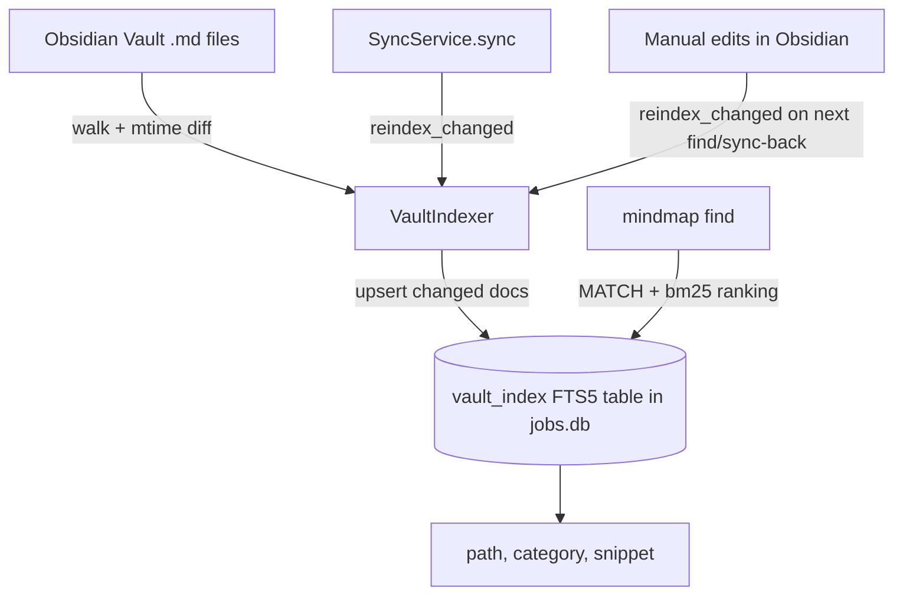

# Vault Search

## Overview

Full-text search over the generated Obsidian vault (job notes, person notes, company notes, and any freeform notes added directly in Obsidian). Built on SQLite's FTS5 extension, stored alongside `jobs.db` — no new service to run or keep in sync.

## Why FTS5, not Elasticsearch

This is a single-user tool running in one Docker container against a SQLite database. Elasticsearch would mean an extra always-running service (JVM, ~1-2GB RAM) plus a sync strategy to keep it in step with `jobs.db`. FTS5 is built into SQLite: same file, same backups, same transactions, and Python's `sqlite3` module here already supports it. The tradeoff is relevance tuning headroom (FTS5's BM25 vs. Elasticsearch's aggregations/fuzzy matching) that this project doesn't need at personal scale.

What FTS5 does **not** give: semantic search ("notes similar to this one" without shared keywords). If that's ever needed, it can be layered on later with `sqlite-vec` embeddings — out of scope for now.

## Data Flow



## Schema

```sql
CREATE VIRTUAL TABLE IF NOT EXISTS vault_index USING fts5(
    path UNINDEXED,
    category UNINDEXED,   -- Jobs | People | Companies | Notes
    title,
    content,
    mtime UNINDEXED
);
```

## Components

- **`VaultIndexer`** (`src/generator/vault_indexer.py`, new): walks `vault_manager.vault_path` for `*.md`, compares each file's mtime against the stored value, and re-indexes only changed files.
  - `reindex_all()` — full rebuild.
  - `reindex_changed()` — incremental; called after sync and before a search.
- **CLI command** — `uv run mindmap find "<query>"` (name `search` is already used for LinkedIn job discovery).
  ```sql
  SELECT path, category, snippet(vault_index, 3, '**', '**', '…', 10) AS snippet
  FROM vault_index WHERE vault_index MATCH ? ORDER BY bm25(vault_index) LIMIT 20;
  ```
  Supports phrase (`"machine learning"`), prefix (`kube*`), and boolean (`remote AND senior`) queries natively.

## Hook Points

- End of `SyncService.sync()` → `reindex_changed()`, since generated notes change there.
- Start of `mindmap find` and `SyncService.sync_from_obsidian()` → `reindex_changed()`, to pick up notes the user edited by hand in Obsidian since the last sync.

## Tasks

- [ ] **Schema**: Add `vault_index` FTS5 table to `DatabaseManager._init_db`.
- [ ] **Indexer**: Implement `VaultIndexer` with `reindex_all()` / `reindex_changed()`.
- [ ] **CLI**: Add `mindmap find <query>` command with ranked, snippeted results.
- [ ] **Sync hooks**: Call `reindex_changed()` from `SyncService.sync()` and `sync_from_obsidian()`.
- [ ] **Tests**: Cover indexing (new/changed/deleted files) and query ranking/snippets.
- [ ] (Future) Semantic search via `sqlite-vec` embeddings, if keyword search proves insufficient.
